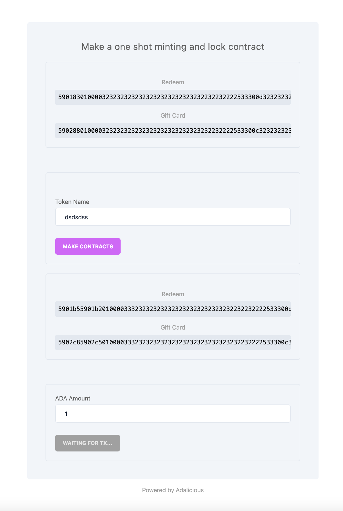

<hr>

<h1 align="center">
  <br>
  <a href="http://txpipe.io"></a>
  <br>
  Adalicious - Aiken Gift Card
  <br>
</h1>

<h4 align="center">Make a one shot minting and lock contract</h4>

<p align="center">
  <a href="#whats-this">What's This</a> •
  <a href="#tech">Tech</a> •
  <a href="#usage">usage</a> •
  <a href="#license">License</a>
</p>
<hr>

## What's This?

This is an example of a gift card. With these contracts you can lock anything
and have it be unlockable only with a simultaneously minted NFT. This minted NFT
holds the power to unlock the assets and is considered the "gift card".

## Tech

- [Aiken](https://aiken-lang.org)
- [Demeter](https://demeter.run)
- [lucid](https://github.com/spacebudz/lucid)
- [Kupo](https://hub.docker.com/r/cardanosolutions/kupo)
- [Ogmios](https://ogmios.dev/)
- [NextJs](https://nextjs.org/)

## Usage

Setup the required ENV variables for initializing Lucid with Kupos and Ogmios. If you are running this on Demeter you can get those variables by enabling the required Extensions and exposing the Port or using the Private DNS if you are running from a Cardano Workspace.

`KUPO_RUL`
`OGMIOS_URL`

The project is pre configured to work against the `Preprod` Network.

Once you configuration is set you can start the project:

```
npm run build
npm run dev
```

You can access the front-end application in your browser at `localhost:3000` 



## License

[MIT](LICENSE)
