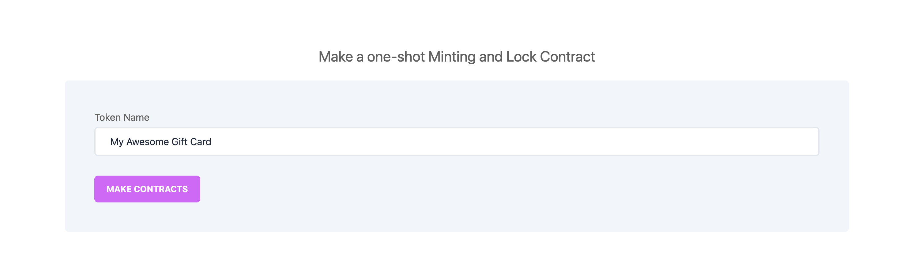
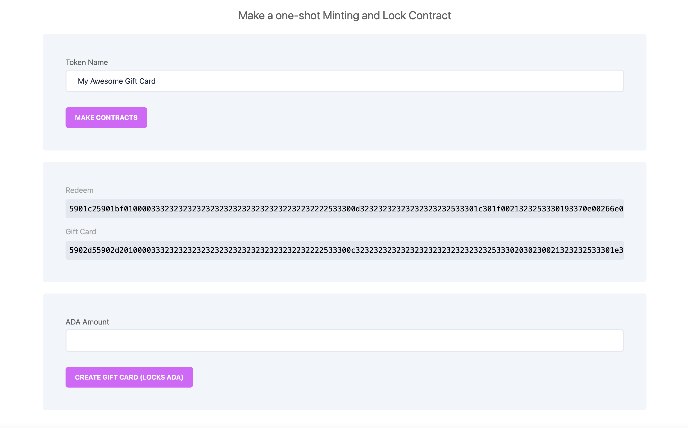
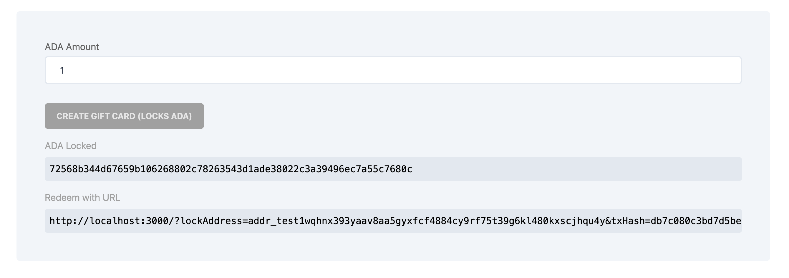
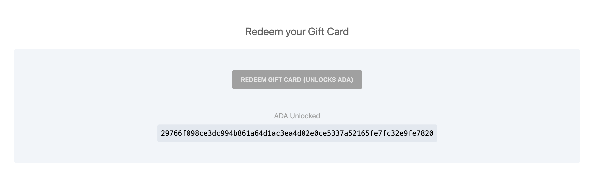

<hr>

<h1 align="center">
  <br>
  <a href="http://txpipe.io"></a>
  <br>
  Adalicious - Aiken Gift Card
  <br>
</h1>

<h4 align="center">Make a one shot minting and lock contract</h4>

<p align="center">
  <a href="#whats-this">What's This</a> •
  <a href="#tech">Tech</a> •
  <a href="#usage">usage</a> •
  <a href="#license">License</a>
</p>
<hr>

## What's This?

This is an example of a gift card. With these contracts you can lock anything and have it be unlockable only with a simultaneously minted NFT. This minted NFT holds the power to unlock the assets and is considered the "gift card".

This starter kit is based on the `Gift Card` example provided in the [Aiken documentation](https://aiken-lang.org/), adapted to work seamless with the Ogmios and Kupo instance provided by [Demeter](https://demeter.run) and implemented as a NextJS application. 

Reference the official documentation for details about how this starter kit was implemented and the logic behind the validators at the [Gift Card example](https://aiken-lang.org/example--gift-card).

## Tech

- [Aiken](https://aiken-lang.org)
- [Demeter](https://demeter.run)
- [lucid](https://github.com/spacebudz/lucid)
- [Kupo](https://hub.docker.com/r/cardanosolutions/kupo)
- [Ogmios](https://ogmios.dev/)
- [NextJs](https://nextjs.org/)

## Usage

Setup the required ENV variables for initializing Lucid with Kupos and Ogmios. 

 - `KUPO_URL`
 - `OGMIOS_URL`
 - `NETWORK`

We are going to need these extensions to be enabled in your Demeter project:


You have the option to run this application from inside a `Cardano Workspace` or by exposing the extensions to external dApps. 

When running from a `Cardano Workspace` you can default the ENV variables to the information already available in your Workspace.

 - `KUPO_URL`: `KUPO_API_HOST:KUPO_API_PORT`
 - `OGMIOS_URL`: `OGMIOS_API_HOST:OGMIOS_API_PORT`

When running from your local environment make sure you are exposing the extension to be available for external dApps. The URL provided should be the value to set in your ENVs. 


**_NOTE:_** Don't forget to add the protocol to the URL when setting up your ENV. Kupo will be exposed under `https` and Ogmios under `wss` 

For the `NETWORK` ENV variable the possible values are:
 - `Preview`
 - `Preprod`
 - `Mainnet`
  
Once you configuration is set you can start the project:

Install the dependencies
```bash
npm install
```

Build an run the application in development mode
```bash
npm run build
npm run dev
```

You can access the front-end application in your browser at `localhost:3000` . 

**_NOTE:_** If you are running the application from inside a Cardano Workspace in Demeter you will have to export the port 3000 for accessing the app in your browser. 


### Create Gift Card

For creating a Gift Card first you need to input a name for your token so you can make the contracts:



Once the contracts are applied you will get the Gift Card and Redeem Scripts and you can select how much ADA you want to lock into the gift card



Once you are ready press the `CREATE GIFT CARD` button. You will be prompted to sign the transaction and the app will wait for the tx to be confirmed. 

Once confirmed you will get the `tx hash` and the `redeem URL`. The owner of the minted NFT can unlock the ADA in the contract by accessing this URL.




### Redeem Gift Card

For redeeming a Gift card you can access the URL generated at the moment of locking ADA, if you are the owner of the minted NFT you will be able to unlock the ADA in the contract.


Press the `REDEEM GIFT CARD` button. You will be prompted to sign the transaction and the ADA will be unlocked to your wallet. The application will show the `tx hash` of the generated transaction.




## License

[MIT](LICENSE)
